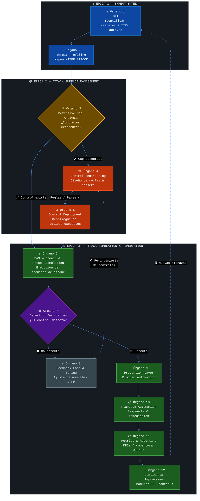

# 🛡️ Lumina — Threat-Informed Defense (TID)

> *"Defend what matters. Validate everything. Improve continuously."*

---

## ¿Qué es Threat-Informed Defense?

**Threat-Informed Defense (TID)** es una estrategia de ciberseguridad **adaptativa, dinámica y proactiva** que alinea cada decisión defensiva con inteligencia real sobre las amenazas que enfrenta una organización.

A diferencia de los enfoques tradicionales basados en listas de verificación o controles genéricos, TID parte de una premisa fundamental:

> **No se puede defender todo. Se defiende lo que importa.**

Esto implica conocer al adversario antes de que actúe, mapear las técnicas reales de ataque sobre el entorno propio y validar de forma continua que los controles defensivos funcionan contra esas técnicas específicas.

---

## Los 3 Pilares de TID

TID se articula en **tres grandes pilares estratégicos**, cada uno respondiendo a una pregunta clave:

| Pilar | Pregunta central |
|-------|------------------|
| 🔵 **Threat Intelligence** | ¿Quién me ataca y cómo? |
| 🟠 **Attack Surface Management** | ¿Qué tengo expuesto y qué tan protegido está? |
| 🔴 **Attack Simulation & Remediation** | ¿Mis defensas funcionan? ¿Cómo respondo cuando fallan? |

---

## Los 12 Órganos Operativos

Cada pilar agrupa un conjunto de **órganos operativos** que convierten la estrategia en capacidades concretas:

### 🔵 Pilar 1 — Threat Intelligence
*Objetivo: generar y consumir inteligencia accionable sobre el adversario.*

| # | Órgano | Función |
|---|--------|---------|
| 1 | **CTI (Cyber Threat Intelligence)** | Identificar actores de amenaza, tácticas activas, vulnerabilidades explotadas en-the-wild y tendencias del ecosistema adversarial. |
| 2 | **Threat Profiling** | Mapear las técnicas del adversario sobre el framework MITRE ATT&CK, construyendo un perfil de amenaza contextualizado al sector y tecnologías de la organización. |

### 🟠 Pilar 2 — Attack Surface Management
*Objetivo: descubrir y mapear todos los activos expuestos, identificar sus vulnerabilidades y asegurar que los controles defensivos los cubren.*

ASM no es solo un análisis de controles: **empieza con un assessment activo de la superficie**. Antes de evaluar si los controles detectan una técnica, hay que saber qué activos existen, qué servicios exponen y qué vulnerabilidades presentan — exactamente lo que hacen herramientas como Nmap, OpenVAS, Tenable ASM o Shodan.

| # | Órgano | Función |
|---|--------|---------|
| 3 | **Asset Discovery & Vulnerability Assessment** | Escaneo activo de la superficie expuesta: puertos abiertos, servicios, dominios, endpoints, IPs y versiones de software. Identificación de vulnerabilidades conocidas mediante análisis de firmas y correlación con bases de datos de CVEs. Herramientas de referencia: Nmap, OpenVAS, Tenable ASM, Shodan. |
| 3b | **Defensive Gap Analysis** | Con el mapa de activos y vulnerabilidades en mano, se evalúa si los controles existentes son capaces de detectar las técnicas del perfil de amenaza que apuntan a esos activos. El resultado es un mapa de cobertura con gaps explícitos. |
| 4 | **Control Engineering** | Diseñar y desarrollar las reglas de detección, parsers, correlaciones y lógica defensiva necesaria para cerrar los gaps identificados. |
| 5 | **Control Deployment** | Desplegar los controles diseñados sobre los activos expuestos, asegurando cobertura efectiva en los vectores relevantes. |

### 🔴 Pilar 3 — Attack Simulation & Remediation
*Objetivo: validar las defensas con ataques reales y activar mecanismos de respuesta.*

| # | Órgano | Función |
|---|--------|---------|
| 6 | **BAS (Breach & Attack Simulation)** | Ejecutar simulaciones de ataque controladas y documentadas, replicando las técnicas del perfil de amenaza sobre el entorno real. |
| 7 | **Detection Validation** | Verificar que los controles desplegados detectaron los ataques simulados. Generar evidencia de cobertura. |
| 8 | **Feedback Loop & Tuning** | Ajustar umbrales, eliminar falsos positivos y refinar reglas de detección en base a los resultados de la validación. |
| 9 | **Prevention Layer** | Activar mecanismos de bloqueo automático para prevenir que los ataques detectados alcancen su objetivo. |
| 10 | **Playbook Automation** | Definir y automatizar la respuesta ante incidentes: aislamiento, notificación, forense y escalamiento. |
| 11 | **Metrics & Reporting** | Cuantificar la cobertura ATT&CK, el tiempo medio de detección (MTTD), la tasa de falsos positivos y la efectividad de prevención. |
| 12 | **Continuous Improvement** | Reiniciar el ciclo con nuevas amenazas, incorporando aprendizajes para elevar la madurez defensiva de forma sostenida. |

---

## 4. Workflow Hipotético de TID dividido en 3 Épicas

### 4.1 ¿Qué es TID y cómo se estructura?

**Threat-Informed Defense (TID)** es una metodología donde cada decisión defensiva está guiada por inteligencia real sobre las amenazas que enfrenta la organización. No se defiende "de todo": se defiende **de lo que importa**, validando continuamente que los controles funcionan.

Para optimizar su ejecución, los 12 órganos operativos se estructuran en **3 Grandes Épicas o Hitos**:

1. **Threat Intel**: Saber *quién* y *cómo* nos ataca.
2. **Attack Surface Management (ASM)**: Saber *dónde* nos van a atacar — descubriendo activamente qué activos, puertos, servicios y vulnerabilidades están expuestos, y verificando qué tan protegidos están.
3. **Attack Simulation & Remediation**: Poner a prueba las defensas (simulación) y accionar mecanismos de prevención/respuesta (remediación).

### 4.2 Mapa conceptual — Pipeline TID por Épicas

| Épica | Órganos | Pregunta clave |
|-------|---------|----------------|
| 🔵 **Threat Intel** | 1 — CTI & 2 — Threat Profiling | ¿Quién me ataca y cómo? |
| 🟠 **Attack Surface Management** | 3 — Gap Analysis, 4 — Control Engineering, 5 — Control Deployment | ¿Qué tengo expuesto y estoy protegido? |
| 🔴 **Attack Simulation & Remediation** | 6 — BAS, 7 — Detection Validation, 8 — Feedback Loop, 9 — Prevention, 10 — Playbook, 11 — Metrics, 12 — Continuous Improvement | ¿Mis defensas funcionan? ¿Cómo respondo? |



### 4.3 Recorrido del pipeline TID

#### 📌 Épica 1: Threat Intel — *Saber quién y cómo me ataca*

**🧠 Órgano 1 — CTI (Cyber Threat Intelligence)**  
Se identifican las amenazas activas relevantes para el entorno objetivo: vulnerabilidades públicas con exploit conocido, campañas activas de actores de amenaza y tendencias de explotación recientes. Las fuentes incluyen feeds públicos, bases de datos de vulnerabilidades, inteligencia de sector y alertas de CERTs.

**🎯 Órgano 2 — Threat Profiling**  
Cada amenaza identificada se mapea sobre la matriz MITRE ATT&CK, construyendo un perfil de TTP (Tactics, Techniques & Procedures) contextualizado. Este profiling responde la pregunta: *¿qué haría exactamente un atacante que explote esta vulnerabilidad en nuestro entorno?*

---

#### 📌 Épica 2: Attack Surface Management — *Saber qué tengo expuesto y qué tan protegido está*

**🗺️ Órgano 3a — Asset Discovery & Vulnerability Assessment**  
El punto de partida de ASM es un **assessment activo de la superficie de ataque**. Se realizan escaneos de red para identificar hosts activos, puertos abiertos y servicios en escucha; enumeración de dominios, subdominios y endpoints expuestos; y detección de vulnerabilidades conocidas en las versiones de software detectadas, correlacionándolas con bases de datos de CVEs.

Esta fase responde: *¿qué activos tengo expuestos y cuál es su postura de seguridad actual?*  
Herramientas de referencia: **Nmap** (discovery & port scanning), **OpenVAS / Greenbone** (vulnerability scanning), **Tenable ASM / Nessus** (gestión continua de superficie), **Shodan / Censys** (visión externa del atacante).

**🔍 Órgano 3b — Defensive Gap Analysis**  
Con el mapa de activos y vulnerabilidades construido en el paso anterior, se evalúa si los controles existentes son capaces de detectar las técnicas del perfil de amenaza que apuntan a esos activos.  
Pregunta central: *¿Nuestros controles actuales detectan las técnicas que un atacante usaría sobre los activos que acabamos de mapear?*  
Se auditan reglas, parsers, watchpoints y configuraciones y se mapean contra las técnicas ATT&CK identificadas. El resultado es un mapa de cobertura con gaps explícitos.

**🏗️ Órgano 4 — Control Engineering**  
Se diseñan los controles de detección necesarios para cerrar los gaps: reglas de correlación en el SIEM, watchpoints de auditoría del sistema operativo, parsers de logs y firmas de comportamiento anómalo. Cada control incluye su mapeo ATT&CK correspondiente.

**⚙️ Órgano 5 — Control Deployment**  
Los controles diseñados se despliegan sobre los activos expuestos del entorno. El despliegue es documentado y versionado, asegurando trazabilidad entre el gap identificado, el control diseñado y el activo protegido.

---

#### 📌 Épica 3: Attack Simulation & Remediation — *Validar defensas y accionar*

**🧪 Órgano 6 — BAS (Breach & Attack Simulation)**  
Se ejecutan simulaciones de ataque controladas que replican con precisión las técnicas del perfil de amenaza. La simulación puede incluir ataques de reconocimiento, acceso inicial, escalada de privilegios, acceso a credenciales y exfiltración, según las TTPs identificadas.

**📊 Órgano 7 — Detection Validation**  
Se verifica con evidencia objetiva si cada control desplegado detectó la técnica simulada. El resultado es una tabla de cobertura: control por técnica, con estado (✅ detectó / ❌ no detectó) y tiempo de detección.

**🔄 Órgano 8 — Feedback Loop & Tuning**  
Con los resultados de la validación, se ajustan los controles: umbrales de alerta, correlación cruzada entre reglas, exclusión de falsos positivos y refinamiento de firmas. Los controles que no detectaron se re-envían al Órgano 4 para re-ingeniería.

**🚨 Órgano 9 — Prevention Layer**  
Una vez validada la detección, se activan los mecanismos de prevención: bloqueo automático de IPs, aislamiento de procesos, cierre de sesiones sospechosas. La prevención opera en tiempo real sin intervención humana.

**📋 Órgano 10 — Playbook Automation**  
Se define la respuesta automatizada ante cada tipo de incidente detectado:
1. **Aislamiento:** bloqueo de red del origen del ataque
2. **Notificación:** alerta inmediata al equipo de seguridad (Slack, Teams, PagerDuty)
3. **Forense:** snapshot del estado del sistema para análisis post-mortem
4. **Escalamiento:** apertura automática de ticket en el sistema de gestión de incidentes

**📈 Órgano 11 — Metrics & Reporting**  
KPIs generados para medir la madurez TID:
- **Cobertura ATT&CK:** % de técnicas del perfil de amenaza detectadas
- **MTTD (Mean Time to Detect):** tiempo entre el inicio del ataque y la primera alerta
- **Tasa de Falsos Positivos:** % de alertas que no corresponden a actividad maliciosa real
- **Tasa de Prevención:** % de ataques detenidos automáticamente sin intervención humana

**🔁 Órgano 12 — Continuous Improvement**  
El ciclo TID no termina: se reinicia con cada nueva amenaza identificada. Nuevas vulnerabilidades, nuevas técnicas adversariales y cambios en el entorno disparan un nuevo ciclo desde el Órgano 1. La madurez TID se mide por la velocidad y precisión con que la organización recorre este pipeline.

---

## Por Qué TID es Adaptativo, Dinámico y Proactivo

| Atributo | Descripción |
|----------|-------------|
| **Adaptativo** | Cada ciclo incorpora el aprendizaje del anterior. Los controles evolucionan junto con las amenazas, no se vuelven obsoletos. |
| **Dinámico** | El pipeline no es lineal ni estático: tiene bucles de retroalimentación (Órgano 8 → Órgano 4) y ciclos de mejora continua (Órgano 12 → Órgano 1). |
| **Proactivo** | No espera a que ocurra un incidente real para mejorar las defensas. La simulación controlada valida la postura de seguridad antes de que el adversario la ponga a prueba. |

---

## Stack Tecnológico de Referencia

TID es **tecnológicamente agnóstico**: puede implementarse con herramientas comerciales o completamente open-source. Un stack de referencia viable incluye:

| Capacidad | Herramientas de referencia |
|-----------|---------------------------|
| **Asset Discovery & Port Scanning** | Nmap, Masscan, Rustscan |
| **Vulnerability Assessment** | OpenVAS / Greenbone, Nessus, Tenable ASM |
| **Visión externa (Attacker View)** | Shodan, Censys, FOFA |
| **SIEM / Detección** | Wazuh, Elastic SIEM, OpenSearch |
| **Prevención / Intel comunitaria** | CrowdSec |
| **Auditoría del SO** | auditd |
| **BAS / Simulación** | Atomic Red Team, Caldera (MITRE) |
| **Framework de mapeo** | MITRE ATT&CK |
| **Orquestación de respuesta** | n8n, Shuffle, TheHive |

---

## Estructura del Repositorio

```
Lumina - TID/
├── README.md           ← Este archivo
├── scripts/            ← Scripts de setup y demo del laboratorio
│   ├── setup_base.sh
│   ├── setup_wazuh.sh
│   └── nginx_dos_demo.sh
└── lab_EvilSec/        ← Documentación técnica del laboratorio de demostración
```

---

> **Lumina - TID** es un framework de referencia para implementar Threat-Informed Defense con herramientas open-source, orientado a organizaciones que priorizan la validación continua sobre la acumulación de controles sin evidencia de efectividad.
