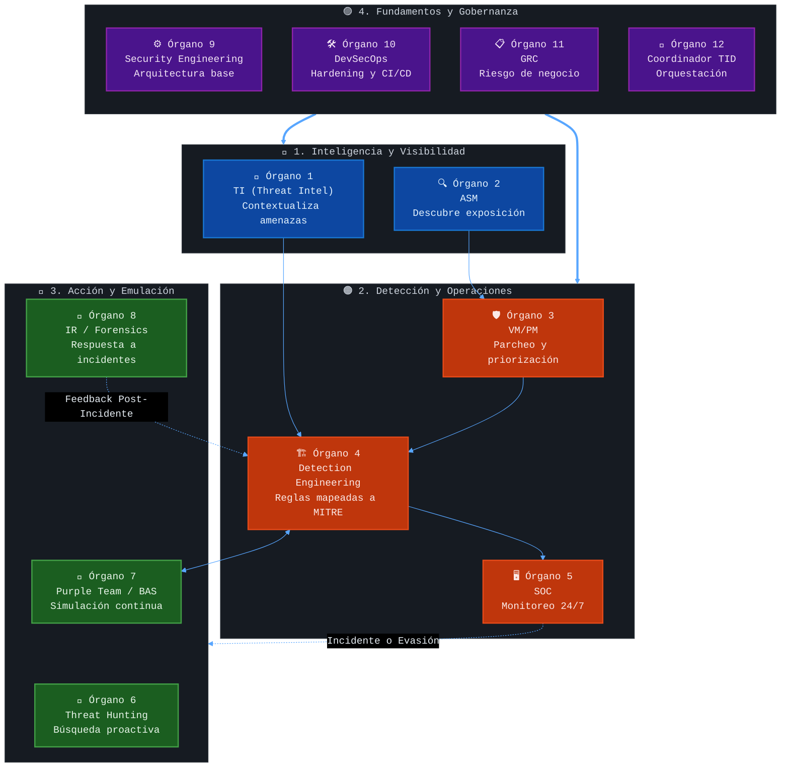
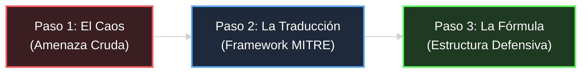
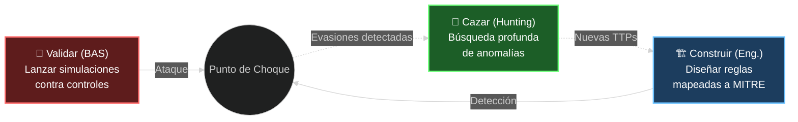
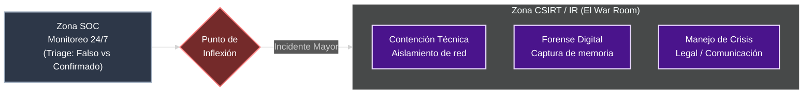

# 🛡️ Lumina — Threat-Informed Defense (TID)

> *"Defend what matters. Validate everything. Improve continuously."*

---

## 1. ¿Qué es Threat-Informed Defense?

**Threat-Informed Defense (TID)** es una estrategia de ciberseguridad **adaptativa, dinámica y proactiva** que alinea cada decisión defensiva con inteligencia real sobre las amenazas que enfrenta una organización.

A diferencia de los enfoques tradicionales basados en cumplimiento ciego (*compliance*), TID asume que los ataques modernos son veloces, furtivos y propulsados por IA ofensiva que opera en milisegundos. De hecho, el **79% de las intrusiones evaden detecciones tradicionales operando sin malware**, utilizando credenciales robadas y herramientas nativas (LotL ofensivo).

Cuando un adversario logra evadir las defensas perimetrales, **el tiempo de *breakout* (el lapso hasta que inicia el movimiento lateral o impacto) puede ser de apenas 51 segundos.** La respuesta manual frente a esta velocidad es insostenible; se requiere una defensa activa, informada y automatizada.

### La Ecuación Fundamental del Riesgo
El núcleo de la estrategia se define por:
**Riesgo = Amenaza × Vulnerabilidad × Impacto**

El riesgo se mitiga de manera más efectiva **suprimiendo la variable de vulnerabilidad** en la superficie de ataque. Su antídoto operativo es **La Tríada T.I.D. en Movimiento:**
1. **Inteligencia de Amenazas:** Entender el comportamiento del atacante.
2. **Gestión de Superficie:** Conocer nuestra exposición y puntos ciegos.
3. **Medidas Defensivas:** Implementar y validar controles basados en los dos puntos anteriores.

---

## 2. Threat Modeling: El Diseño vs La Operación

Para construir una defensa informada por inteligencia de amenazas, es vital aplicar el modelo correcto en la fase adecuada del Ciclo de Vida de Desarrollo (SDLC) o de la arquitectura corporativa.

### STRIDE y el Modelado en Fase de Diseño
**STRIDE** (Spoofing, Tampering, Repudiation, Information Disclosure, Denial of Service, Elevation of Privilege) es una metodología de Threat Modeling creada por Microsoft. Se implementa principalmente en la **Fase de Diseño o Arquitectura**. Su objetivo es identificar fallas estructurales antes de escribir código o desplegar infraestructura, cuando remediar vulnerabilidades es infinitamente más económico.

### Modelos Similares y Complementarios
Dependiendo del enfoque del negocio, existen alternativas o complementos a STRIDE:

- **PASTA (Process for Attack Simulation and Threat Analysis):** Centrado en el riesgo empresarial. Alinea las amenazas técnicas con el impacto financiero o reputacional. Muy valorado por la alta gerencia.
- **DREAD:** Modelo de clasificación de riesgos. Usualmente aplicado *después* de STRIDE para puntuar las amenazas descubiertas (del 1 al 10) según Daño, Reproducibilidad, Explotabilidad, etc.
- **LINDDUN:** Metodología especializada al 100% en la **Privacidad** de los datos. Ideal para entornos regulados (GDPR, HIPAA).
- **VAST:** Enfoque ágil y visual diseñado para integrarse velozmente en entornos modernos de CI/CD (DevOps).

### STRIDE vs MITRE ATT&CK en T.I.D.
Mientras que metodologías como **STRIDE** o **PASTA** aseguran que "la casa se construya sin ventanas rotas", **MITRE ATT&CK** (el corazón de Threat-Informed Defense) se usa en la fase operativa para entender y emular "cómo actúan los ladrones reales hoy en día", validando si los controles como Wazuh o CrowdSec son capaces de detectarlos y bloquearlos.

---

## 3. El Ecosistema T.I.D. (Los 4 Cuadrantes y 12 Órganos)

TID es un engranaje completo, no una herramienta aislada. Se articula a través de 4 cuadrantes funcionales (también conocidos históricamente en la madurez del proyecto como "Épicas") que agrupan 12 órganos operativos.

### 🔵 1. Inteligencia y Visibilidad
- **1. TI (Threat Intel):** Contextualiza amenazas mediante marcos de TTPs adaptables al negocio (ej. STRIDE para el sector salud, PASTA para telecomunicaciones), priorizando protecciones fundamentales sobre modelados teóricos.
- **2. ASM (Attack Surface Management):** Descubre la exposición de activos (Internet-facing) y mapea vulnerabilidades críticas.

### 🟠 2. Detección y Operaciones
- **3. VM/PM (Vulnerability & Patch Management):** Parcheo y priorización continua de los activos descubiertos.
- **4. Detection Engineering:** Traducción de comportamientos a reglas de detección mapeadas a MITRE ATT&CK.
- **5. SOC:** Triage de alertas y monitoreo operacional 24/7.

### 🔴 3. Acción y Emulación
- **6. Threat Hunting:** Búsqueda proactiva, manual y profunda de anomalías que evadieron las alertas automáticas.
- **7. Purple Team / BAS:** Simulación continua de ataques para validar de forma empírica la eficacia de los controles.
- **8. IR / Forensics:** Respuesta a incidentes, contención técnica y peritaje.

### 🟣 4. Fundamentos y Gobernanza
- **9. Security Engineering:** Diseño, despliegue y mantenimiento de la arquitectura de seguridad.
- **10. DevSecOps:** Hardening de infraestructura y despliegue de código seguro ("Security as Code").
- **11. GRC (Governance, Risk & Compliance):** Alineación del riesgo técnico con el riesgo de negocio.
- **12. Coordinador TID:** Orquestación estratégica, gestión de presupuesto y liderazgo táctico del ecosistema.

### 🗺️ Mapa Conceptual: El Ecosistema T.I.D.



---

## 4. Fases Operativas: Del Caos a la Respuesta

La operación del pipeline TID no es lineal; ocurre en **tres fases críticas** que convierten el miedo a lo desconocido en ingeniería determinista.

### Fase 1: Traducción de la Amenaza
ATT&CK no es solo un mapa, es el lenguaje universal que estructura el caos.


> *Ejemplo: Un ransomware detectado en el sector salud (Caos) se descompone en comportamientos observables como T1059 Command and Scripting Interpreter (Traducción), que a su vez se traduce en "Táctica + Técnica = Regla de Detección" (Fórmula).*

### Fase 2: Ingeniería de Detección y Caza Proactiva
> *"Si no validaste tu SIEM disparando el ataque, tu detección es solo una suposición."*



### Fase 3: La Operación post-Alerta (El Handshake crítico)
Alineado con el umbral de los 51 segundos, esta fase dictamina cómo el SOC y el CSIRT interactúan: el Nivel L1 realiza el triaje primario en el SIEM, el L2 ejecuta la validación técnica empírica, y el CSIRT asume la contención evaluando el incidente en base a la ecuación del riesgo.



---

## 5. Filosofía "Living off the Land" (Sustitución Táctica LoL)

La seguridad corporativa no siempre equivale a comprar herramientas nuevas y costosas. La filosofía **Defensiva LoL (Living off the Land)** significa exprimir y aprovechar las capacidades ya instaladas y de código abierto para lograr resultados empresariales:

| Función T.I.D. | Enfoque Tradicional (Gasto) | Sustitución Táctica LoL (Optimización) |
|---------------|-----------------------------|----------------------------------------|
| **Threat Intel** | Feeds comerciales premiums | OTX AlienVault, flujos de BI (Power BI, n8n) para inteligencia de riesgos |
| **ASM** | Plataformas EASM Enterprise | Nmap, auditorías de config, plataformas pasivas (Zabbix, WSUS, SCCM) usadas como sensores |
| **Detección** | EDRs comerciales complejos | OSQuery, Sysmon, VSS, Event Forwarding, **Wazuh** |
| **Purple Team** | BAS Comercial cerrado | **Atomic Red Team**, validación empírica programada |
| **Hardening** | Herramientas de 3eros | GPOs nativos, **CrowdSec** (inteligencia curada consensuada que reduce fatiga del SOC en un 80%) |

Esta es la justificación principal de la arquitectura **Lumina**: una validación de seguridad de alto impacto utilizando el stack actual.

---

## 6. Stack Tecnológico del Laboratorio (EvilSec)

El entorno práctico **Lumina - EvilSec Lab** materializa la filosofía LoL y el modelo TID empleando herramientas de código abierto potentes y ampliamente integrables:

| Capacidad | Herramientas en el Lab |
|-----------|---------------------------|
| **Endpoint Security & SIEM** | Wazuh Manager y Agent |
| **Prevención Perimetral Activa**| CrowdSec + Bouncer de iptables |
| **Ingeniería Inversa / Web** | Nginx (Proxy y Vector de Ataque) |
| **Simulación de Ataque** | Scripts nativos (`privilege_escalation_demo.sh`, `slowloris.py`) |
| **Respuesta Activa (IR)** | Wazuh Active Response (bloqueo en `/etc/shadow`) |

### Estructura del Proyecto

```
Lumina - TID/
├── README.v2.md        ← Este documento maestro de la arquitectura TID
├── scripts/            ← Automatización de despliegues, ataques y recuperación
│   ├── rebuild_tid_lab.sh
│   ├── recover_lab.sh
│   ├── nginx_dos_demo.sh
│   └── privilege_escalation_demo.sh
├── Info/               ← Material complementario y Rundown
└── lab_EvilSec/        ← Artefactos y SITREPs detallados de la operación
    ├── SITREP_Wazuh_ActiveResponse.md
    └── evidencias/     ← Respaldo en JSON de detecciones
```

> **Lumina - TID** transforma la ciberseguridad corporativa: pasa de ser un gasto reactivo impulsado por el miedo, a una ventaja competitiva de negocio, orquestada de forma medible, probada y adaptativa.
